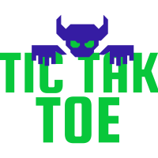

# Tic Tac Toe



I have decided for my second project to develop a small game we all know called Tic Tac Toe, the reason for the is because it shows off
what I have learnt so far with javascript and its a one of the more complex games to develop. I used to love this game and feel like 
it still hasn't got old. THe idea is to make this a multiplayer game which can eiter end in a win or a draw. Im hoping to design this
to look a little different than the old version of the game to give it a more up to date look.

Here you can find a demo of the deployed website [here](https://mat2801.github.io/project2-tic-tac-toe/)

Here you will find screenshots of the deployed website [here](documents/screenshots//)

---

## UX

#### 1.1. Project Goals
My goals for this project are to show what i have learnt so far in javascript along with adding some nice styling
i decided to make a Tic Tak Toe game. The reason i choose thise game is because i always used to enjoy playing this 
game, many people know this game already and its always a good laugh. The primary focus of this project, is to allow full 
functional interaction with it's users to allow for a quick and easy user experience. 
My main goal was to create a interactive easy to use game. I choose to use a simple layout using an attractive landing page image, 
to catch users attention. I opted for a colour scheme of black, green and blue, the reason for this is the darker colour suits
the games look like old fashioned style along with the blue and green to compliment the logo. 


#### 1.2. Wireframes

All ```Wireframes``` were designed using [Balsamiq](https://balsamiq.com/) Follow the links below 

|      Desktop on Acer Aspire 5     |
|      :-----:      |
|[Main Menu](documents/wireframes//Desktop-mainmenu.PNG)|
|[Play Game](documents/wireframes//Desktop-gamescreen.PNG)|
|[Restart Game](documents/wireframes//Desktop-restartgame.PNG)|
|[How To Play](documents/wireframes//Desktop-howtoplay.PNG)|

|      Tablet in iPad/iPad Pro view     |
|      :-----:      |
|[Main Menu](documents/wireframes//Tablet-mainmenu.PNG)|
|[Play Game](documents/wireframes//Tablet-gamescreen.PNG)|
|[Restart Game](documents/wireframes//Tablet-restartgame.PNG)|
|[How To Play](documents/wireframes//Tablet-howtoplay.PNG)|

|      Mobile in iPhone 5, 6, 7, 8, X     |
|      :-----:      |
|[Main Menu](documents/wireframes//Mobile-mainmenu.PNG)|
|[Play Game](documents/wireframes//Mobile-gamescreen.PNG)|
|[Restart Game](documents/wireframes//Mobile-restartgame.PNG)|
|[How To Play](documents/wireframes//Mobile-howtoplay.PNG)|

---

#### 1.3. User Stories
 
- As the developer, I want the users to enjoy and like playing the game.
- As the developer, I would like the user to see detail in the design of the game. 
- As the developer, I want the website to show my ability to code in HTML and CSS and use of javascript, So I can achieve a positive user experience for the site visitors.
- As a developer, I want to play the game on the go and at home on firefox. 
- As a User I don't have a PC or laptop at home and usually do my gaming via my mobile phone.
- As a user, I want to easily understand how to play the game.
- As a user, I want to enjoy playing the game so that I can recommend it to others.
- As a user, I would like to easily access the rules of the game.
- As a user, I want to be able to play the game as many times as I wish.
- As a user, I want the game website to be easy to navigate so I can find the game and the instructions quickly.
 
## Features

#### 2.1. Existing Features

**Main Menu**

- **Landing Image**: This is the game logo created to look old school and draw users attention.
- **Call to action buttons**: Here are to buttons play game and how to play

**Play Game**

- **Game Screen**: The screen will display a game board with 9 cells each cell will be empty until the user clicks a spot, there will
                   also be a main menu button taking the user back to the main menu screen.

**How to Play**

- **Game Rules**: A box will display the rules on how to play the game and a main menu button.

**Controls**:

- **Controls**: Using the mouse right click to play the game.
 

#### 2.2. Future Features
- Animated logo 
- Play againt AI
- Multiplayer/Online mode 
---

## Technologies Used
- [w3c Validator](https://validator.w3.org/) - To check for any errors in the HTML code.
- [Jigsaw](https://jigsaw.w3.org/css-validator/) - To check for any errors in the style.css file. 
- [Gitpod](https://gitpod.io/) - Used to devlop the website. 
- [GitHub](https://github.com/) - Used to host the project.
- [Google Fonts](https://fonts.google.com/) - Used to add font Pacifico . 
- [HTML](https://en.wikipedia.org/wiki/HTML) - This was used to create the structure and provide the contents to my website.
- [CSS](https://en.wikipedia.org/wiki/CSS) - This was used to create the styling for my website.
- [JavaScript](https://en.wikipedia.org/wiki/JavaScript) - This was used to create run the game and any other user activity.
- [FreeLogoDesign](https://www.freelogodesign.org/) - This was used to create my logo.


---

## Testing

Please see the testing process [here]()

---

## Deployment

**How to deploy the project**

Hosted on github pages

1. Load up GitHub and find the correct repository.
2. Using the project's repsoitory menu, at the top on the menu select **settings**.
3. Scroll down until you see the **pages** section
4. Now click on the **drop-down** menu and select the option **Master Branch**.
5. The page refreshes and scrolls you back to the top, scroll down back to the **pages** section.
6. The link to your deployed website will now be there.

[Follow this link](https://docs.github.com/en/pages/getting-started-with-github-pages/configuring-a-publishing-source-for-your-github-pages-site) to see how to depoloy to GitHub pages. 

**How to run code locally**

1. Load up GitHub
2. Find the project's repository
3. Under the repository's name click **Clone**
4. In the **clone with HTTPS** copy the url.
5. Choose your IDE and open **git Bash**.
6. Change the current working directory to the location where you want the cloned directory to be made.
7. Now type **Git Clone**, and paste the url copied from github.
8. Just press **enter** and you clone will be copied over.

---

## Credits
- [Youtube](https://www.youtube.com/) - Helped with creating my game board using cells and structuring the gameplay.


### 6.1. Media
- [Youtube](https://www.youtube.com/) - Helped with creating my game board using cells.
- [FreeLogoDesign](https://www.freelogodesign.org/) - This was used to create my logo.

### 6.2. Acknowledgements
[Precious Ijege](https://www.linkedin.com/in/precious-ijege-908a00168/?originalSubdomain=ng) for the incredible mentoring support.
The [Code Institute](https://codeinstitute.net/) student care, slack and mentors. 
Anthony from slack was a great help. 