# Testing

## Starting off with validation of the code

[CSS Validator](https://jigsaw.w3.org/css-validator/)
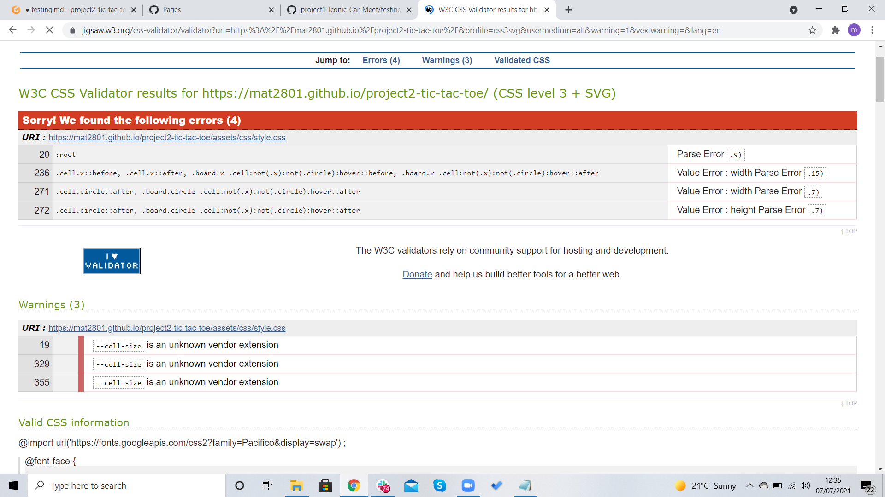

- I decided to research my errors, after going through my code i could not see any issues withing my CSS. I found that unfortunatly this was an issue with CSS Validator. This was a bug on there end with them being a little outdated and new
code always coming in its hard for the validator to keep up to date. Below are screenshots of a couple of things i found regarding this issue.

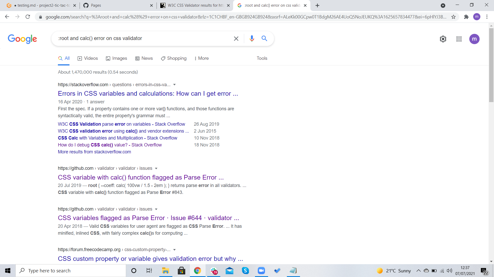

[HTML Validator](https://validator.w3.org/)
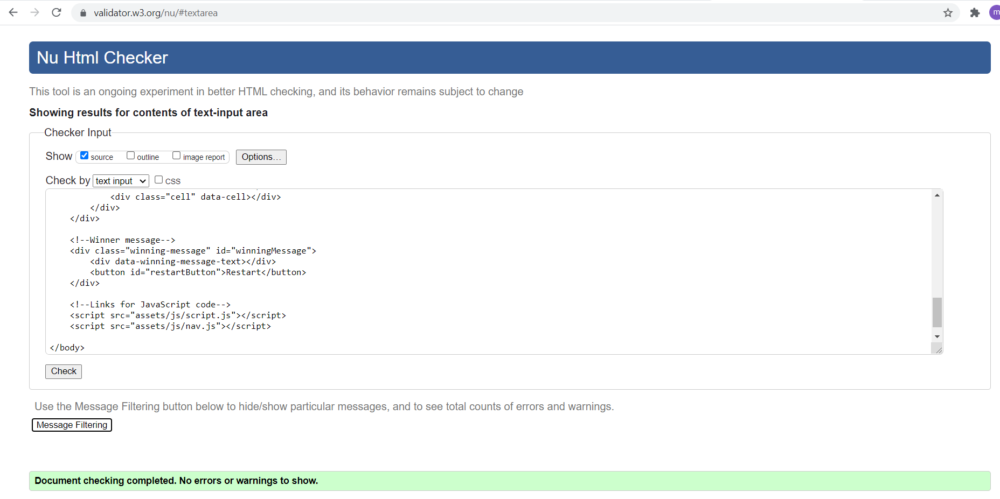 

[JavaScript Validator](http://pythontutor.com/visualize.html#mode=edit)
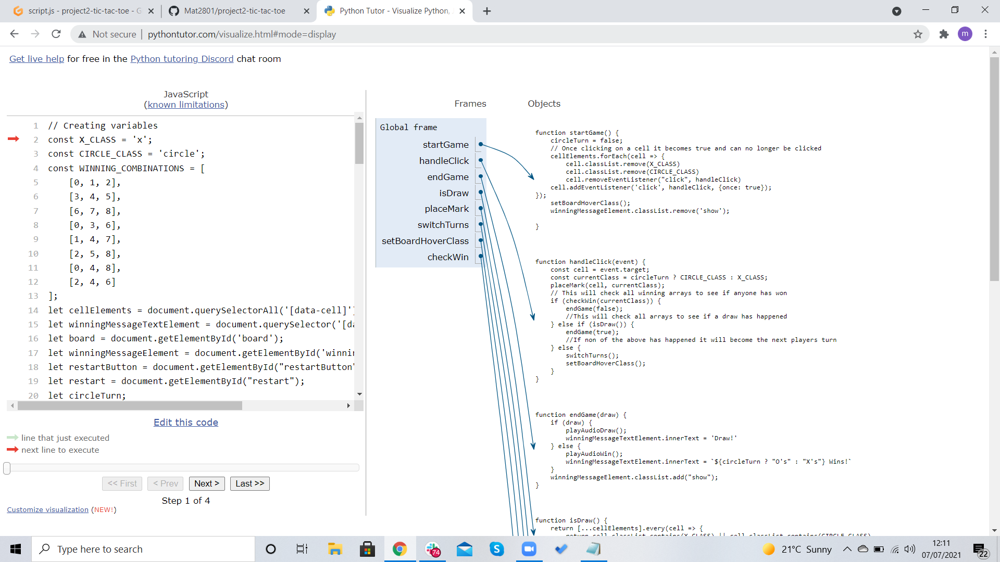
- All javascript code was tested throught writing my code using pythontutor.

---

## Browser Compatability

- Tested over 4 different browsers and worked correctly.

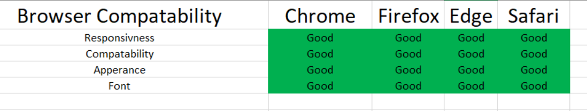

---

## Responsivness

- I tested all devices using [ChromeDevTools](https://developer.chrome.com/docs/devtools/)

#### Desktop Tests

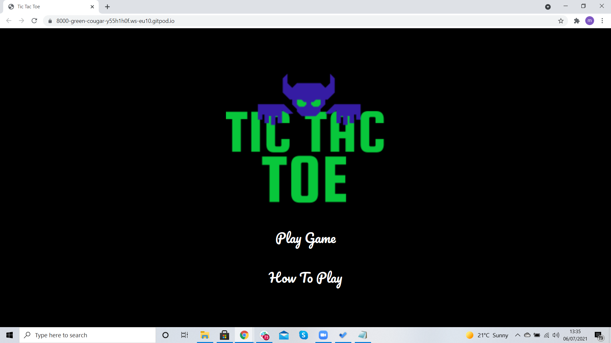
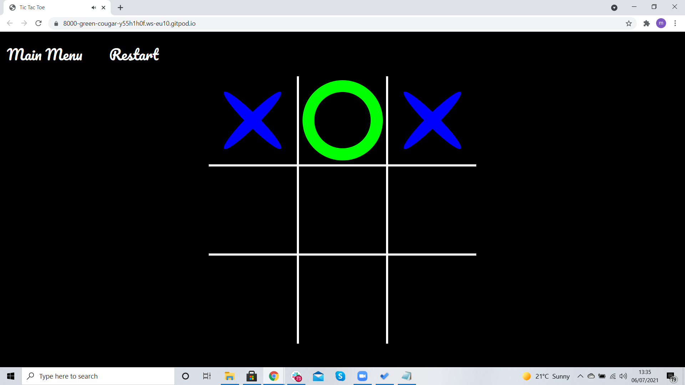
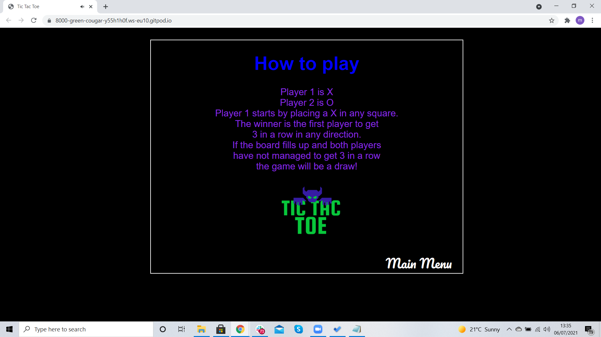

#### Tablet Tests

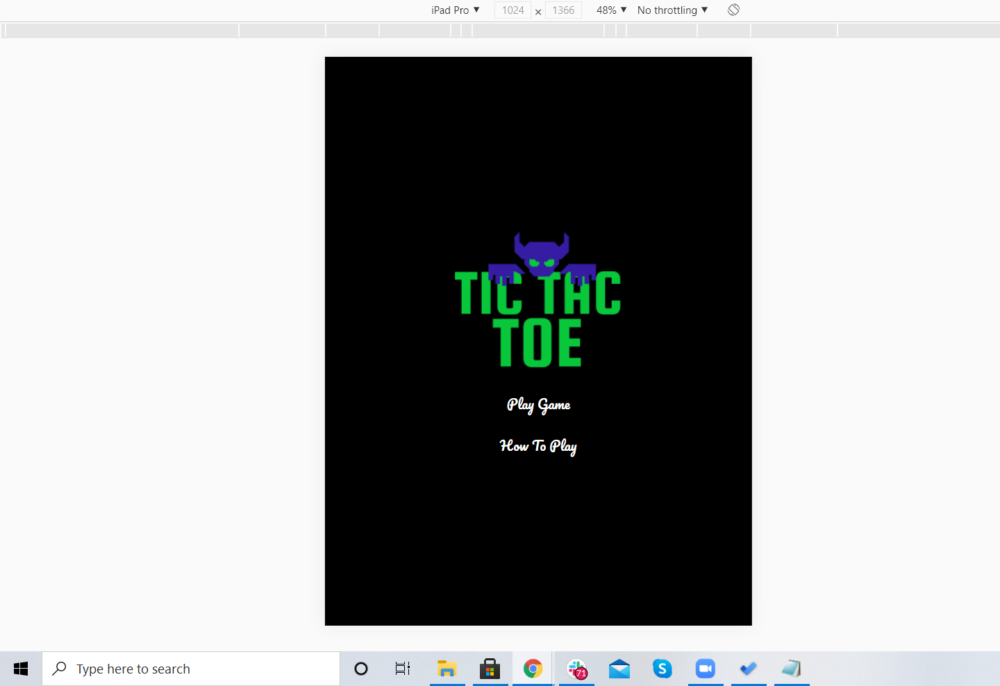
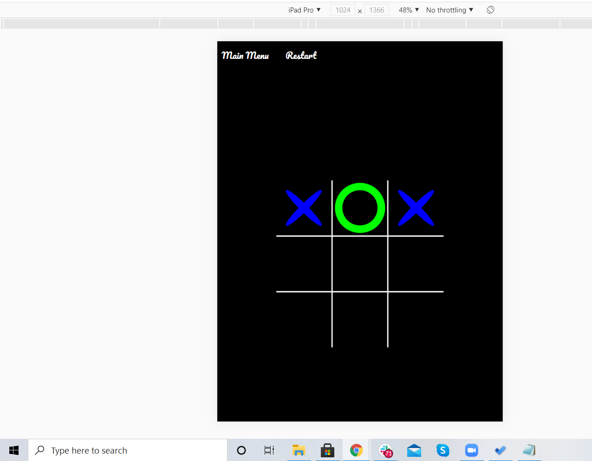
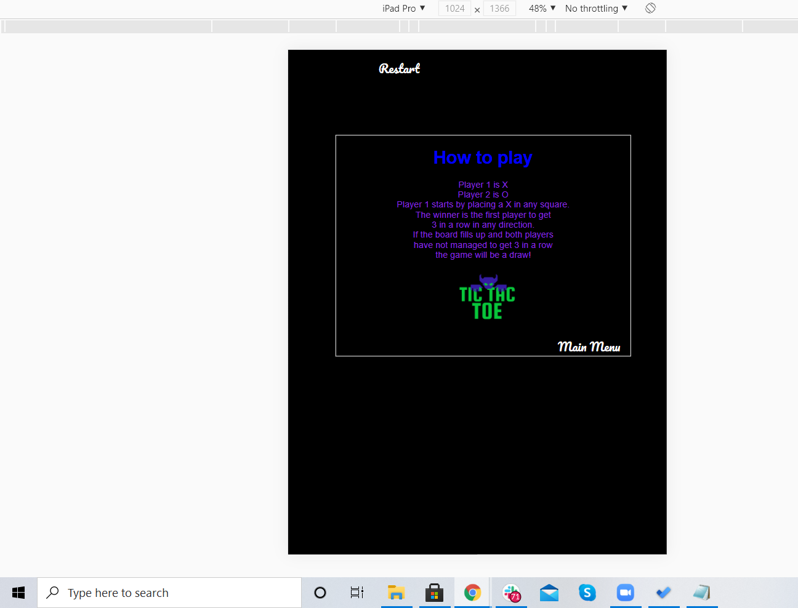

#### Mobile 

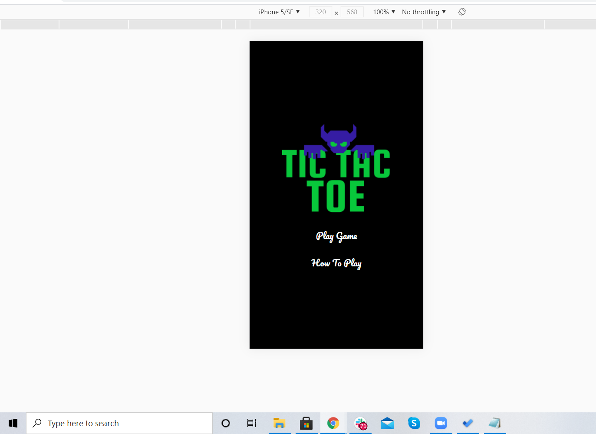
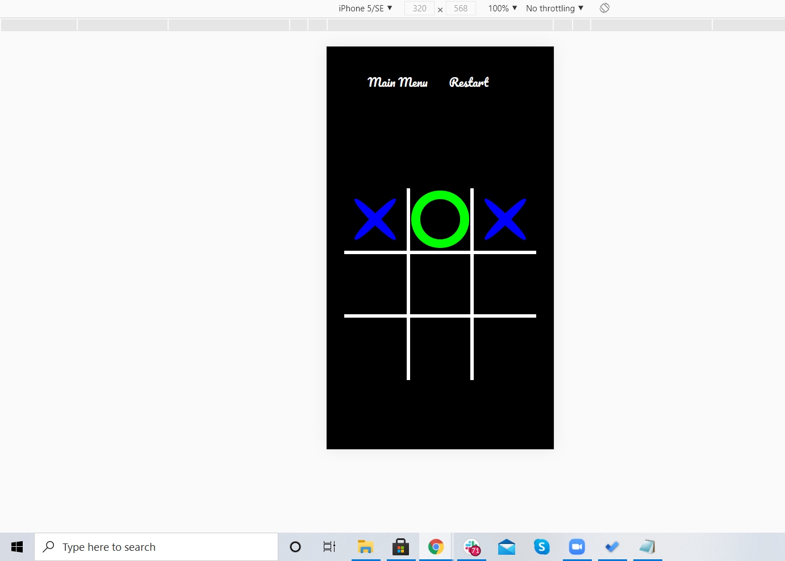
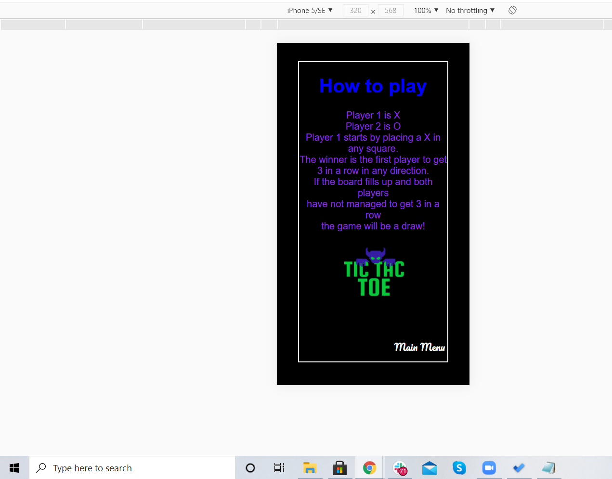

---

## Testing User Stories

##### *First Time User
- As a first time user, I would like to play this game via my mobile phone.
   * This game has been made responsive on all devices and tested using dev tools. 
- As a first time user, I want to easily understand how to play the game.
   * From the main menu screen there is a button which say **How To Play** click this and you will see all instructions.
- As a first time user, I would like to easily play the game.
   * From the main menu screen there is a button which says **Play Game** click this and you can start playing.

  ##### *Returning Visitor
- As a returning user, I want to be able to play the game as many times as I wish.
   * Once loaded into the game screen there will be a **reset button** at the top of the users screen this will reset the game 
     as many times as they like.
   * Once the game has finished the user is prompt with a **restart** option.
- As a returning user, I would like to access the game via my tablet.
   * The game is fully responsive on **all** devices.

  ##### *Frequent User Goals
- As a frequent user, I want to play the game on the go and at home.
   * The game is easily playable home or away due to **responsiveness** for all devices and **browser compatability**
- As a frequent user, I would like to easily navigate straight to the game.
   * The game can easily be played with the by clicking the **Play Game** button.

---

## Current Bugs
- CSS is showing errors as seen on the validation screenshots. This is a known bug with the CSS validator, i have provided     screenshots of the research i have done about these errors and warnings. 
- Gitpod.yml file has 2 errors, these errors are known by Coding Institute. 

#### Bugs that have been fixed
- Main menu image was carrying over to other pages, fixed using javascript to hide the image when otherscreens loaded
- Grid display broke whenever trying to restyle. Fixed by adding extra container and styling the grid seperate.
- Using onClick functions in html fixed using addListenerEvents in Javascript
- Main menu button on rules screen wouldn't display after being used once, fixed by creating a function in javascript allowing it to display the mainmenu function.

Head back to the [ReadMe file](README.md)